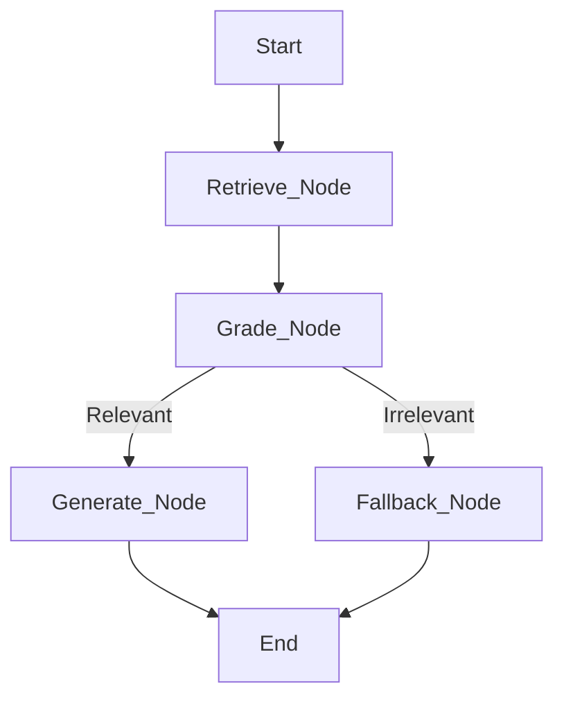

# Stage 3: LangGraph Implementation

Welcome to the final stage! We are now using **LangGraph** to model our RAG pipeline as a stateful, modular graph.

---

## 📈 What Changed from Stage 2?

In Stage 2 (LangChain), we used a "Chain" which is a linear, pre-defined sequence of steps:
`User -> Retriever -> Prompt -> LLM -> Answer`.

In **Stage 3 (LangGraph)**, we treat each Step as a **Node** in a graph:
- **`retrieve` Node**: Responsible solely for fetching data.
- **`generate` Node**: Responsible solely for reasoning over the data.

### Why use a Graph for RAG?
- **Modularity**: Nodes can be tested independently.
- **Decision Logic**: In this implementation, we added a **Grader** node. If the retrieved documents aren't relevant to your question, the graph *decides* to use a fallback message rather than hallucinating an answer.
- **State Management**: The graph maintains a shared `AgentState` object that flows between nodes, collecting data at each step.

---

## 🛠️ How to Run

1.  **Activate Environment**:
    ```powershell
    ..\venv\Scripts\activate
    ```
2.  **Add API Key**: Ensure your `.env` is set up with `GOOGLE_API_KEY`.
3.  **Run Ingestion**:
    ```powershell
    python ingestion.py
    ```
4.  **Ask Questions**:
    ```powershell
    python query.py
    ```

---

## 🏗️ Graph Structure in this Project



In this Stage 3 implementation, we've moved beyond linear chains to a **Decision-based Workflow**!

